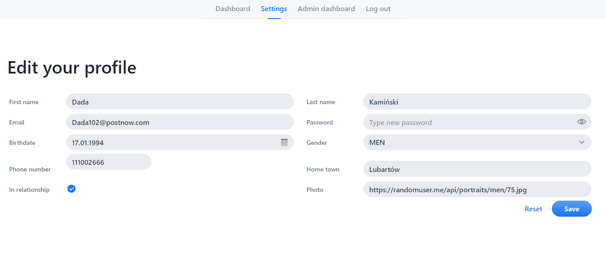
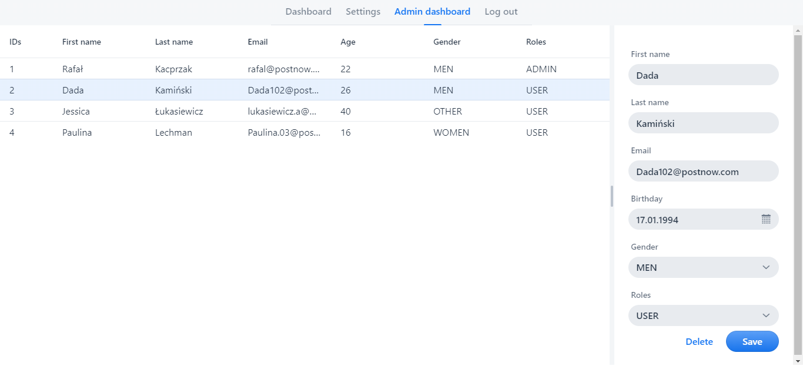

# PostNow

PostNow is a platform that allows authenticated users to write posts and comments which can be liked and shared. However, the basic function is registration and log in of users and admins - which have the ability to manage all other accounts. The website has basic server and (sometimes) client level validation.

### Technologies

* Java 11
* Spring Boot 2.2.0
* Spring Security
* Apache Tomcat 9.0.27
* H2/MySQL database
* Vaadin 14.1.26
* Node.js
* Lombok

### Todos

* Fix bugs
* Clear & clean code
* Write tests
* Heroku & Jenkins
* E-mail verification (mail service)
* HTTPs
* OAuth 2.0

### Pictures

License
----

 [MIT](https://github.com/Rafal-9k/PostNow/blob/master/LICENSE.md)
